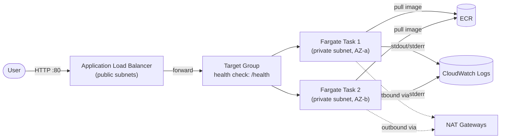
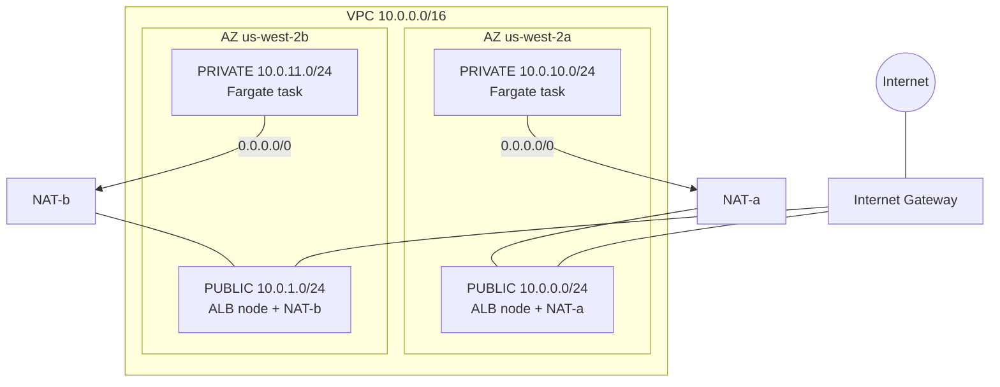
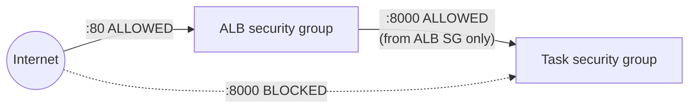
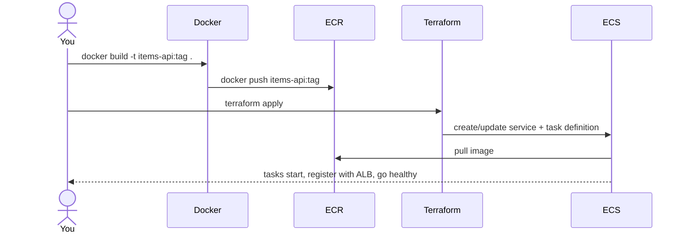

# Architecture & Code Walkthrough — Project 1

A complete explanation of **what** we built, **how** every piece works, and
**why** each decision was made. Read this top-to-bottom to understand the whole
system, or jump to a section to refresh one layer.

- [1. The big picture](#1-the-big-picture)
- [2. The request journey (end to end)](#2-the-request-journey-end-to-end)
- [3. Layer by layer](#3-layer-by-layer)
  - [3.1 Application — FastAPI](#31-application--fastapi)
  - [3.2 Tests](#32-tests)
  - [3.3 Container — Dockerfile](#33-container--dockerfile)
  - [3.4 Image registry — ECR](#34-image-registry--ecr)
  - [3.5 Infrastructure as Code — Terraform](#35-infrastructure-as-code--terraform)
- [4. How a deployment works today](#4-how-a-deployment-works-today)
- [5. Terraform file map](#5-terraform-file-map)
- [6. Cost breakdown](#6-cost-breakdown)
- [7. Design decisions & tradeoffs](#7-design-decisions--tradeoffs)
- [8. Known limitations & next steps](#8-known-limitations--next-steps)
- [9. Glossary](#9-glossary)

---

## 1. The big picture

We took a small Python web API and ran it as a **highly available, internet-facing
service on AWS**, with the entire cloud environment defined in code.

```
  ┌─────────┐   git push    ┌──────────┐   docker push   ┌─────────┐
  │   You   │ ────────────► │  Laptop  │ ──────────────► │   ECR   │
  └─────────┘   (code)      │  build   │   (image)       │(registry)│
                            └────┬─────┘                 └────┬────┘
                                 │ terraform apply             │ pull
                                 ▼ (infrastructure)            ▼
                            ┌─────────────────────────────────────┐
                            │            AWS (us-west-2)           │
                            │   VPC → ALB → ECS Fargate tasks      │
                            └─────────────────────────────────────┘
                                          ▲
                                          │ HTTP
                                     ┌────┴────┐
                                     │  Users  │
                                     └─────────┘
```

The same picture as a rendered diagram (GitHub/VS Code-Mermaid):



**One-sentence summary:** users hit a load balancer on the public internet; it
forwards to containers running in private subnets; those containers were pulled
from a private registry; and every bit of that environment is reproducible from
Terraform code.

---

## 2. The request journey (end to end)

Follow a single `GET /health` request through every hop:

```
1. User's browser  ──►  DNS resolves items-api-alb-xxxx.us-west-2.elb.amazonaws.com
2. Request arrives at the ALB on port 80 (public subnet)
3. ALB's security group check: "is :80 allowed from the internet?"  ✔ yes
4. ALB picks a healthy target from the Target Group (round-robin)
5. ALB opens a connection to Task N's private IP on port 8000
6. Task's security group check: "is :8000 allowed FROM the ALB's SG?"  ✔ yes
7. uvicorn (inside the container) receives the request
8. FastAPI routes it to the health() function → returns {"status": "ok"}, HTTP 200
9. Response travels back up the same path to the user
```

Two checkpoints in that flow are the heart of the security model:

- **Step 3** — the ALB is *meant* to be public, so its firewall allows the world in on :80.
- **Step 6** — the task's firewall allows traffic **only from the ALB's security
  group**, never directly from the internet. There is no path for a user to reach
  the container except *through* the load balancer.

Separately, the ALB calls `/health` on each task every 30 seconds. Tasks that
return `200` stay "in rotation"; tasks that fail 3 checks in a row are pulled out
and replaced. That is what makes the service self-healing.

---

## 3. Layer by layer

### 3.1 Application — FastAPI

**File:** `app/main.py`

A minimal REST API with four routes:

| Method | Path | Purpose |
|--------|------|---------|
| GET | `/health` | Liveness check the load balancer polls |
| GET | `/` | Service identity / smoke test |
| GET | `/items` | List items |
| POST | `/items` | Create an item |
| GET | `/items/{id}` | Fetch one item |

Key design points:

- **`/health` is deliberately cheap and dependency-free.** It returns a static
  `{"status": "ok"}`. It must answer fast and never depend on a database, because
  it runs every 30s per task and gates whether the task receives traffic.
- **Pydantic models** (`ItemIn`, `Item`) give automatic request validation and
  response shaping. A bad POST body is rejected with a clear 422 before your code
  runs.
- **State is in-memory** (`_items` dict). This is intentional for Project 1 — it
  keeps the focus on deployment. The consequence is important and worth
  understanding (see the note below).

> **Why `GET /items` sometimes looks empty:** there are **two** tasks, each with
> its **own** in-memory dict. The ALB round-robins between them, so a POST might
> land on Task 1 and the next GET on Task 2. This is the classic lesson that
> **stateless app instances need a shared datastore** — which is exactly what
> Project 2 adds with AWS RDS.

### 3.2 Tests

**File:** `tests/test_main.py`

Three tests using FastAPI's `TestClient`, which calls the app **in-process** (no
running server, no network) — so they're fast and deterministic:

- `test_health_returns_ok` — the health contract the ALB depends on.
- `test_create_then_fetch_item` — the happy path for creating and reading.
- `test_fetch_missing_item_returns_404` — the error path.

`conftest.py` (empty, at the repo root) exists only so pytest treats the root as
the import base, letting tests do `from app.main import app` with zero config.

These tests will become the **gate** in the CI pipeline (Milestone 5): if they
fail, no image is built and nothing deploys.

### 3.3 Container — Dockerfile

**File:** `Dockerfile`

A **multi-stage** build. The point of multi-stage is to keep build-time tools out
of the final shipped image.

```
┌───────────────── Stage 1: builder ─────────────────┐
│ FROM python:3.13-slim                               │
│  • create a virtualenv at /opt/venv                 │
│  • COPY requirements.txt   (only this, first)       │
│  • pip install -r requirements.txt                  │
└─────────────────────────────────────────────────────┘
                       │ copy ONLY the finished venv
                       ▼
┌───────────────── Stage 2: final ───────────────────┐
│ FROM python:3.13-slim                               │
│  • create non-root user "appuser"                   │
│  • COPY --from=builder /opt/venv  /opt/venv         │
│  • COPY app ./app                                   │
│  • USER appuser                                     │
│  • CMD uvicorn app.main:app --host 0.0.0.0 :8000    │
└─────────────────────────────────────────────────────┘
            Result: ~246 MB image, no pip/build cruft
```

Why each decision matters:

| Decision | Reason |
|----------|--------|
| Multi-stage build | Final image has no build tools/caches → smaller, smaller attack surface |
| `python:3.13-slim` base | ~150 MB vs ~1 GB for full `python` → less to pull, fewer CVEs |
| Copy `requirements.txt` *before* app code | Docker layer caching: deps only reinstall when they change, not on every code edit |
| Non-root `appuser` | If the app is compromised, the attacker isn't root inside the container |
| `PYTHONUNBUFFERED=1` | Logs flush immediately to stdout → CloudWatch sees them in real time |
| `--host 0.0.0.0` | Listen on all interfaces so traffic from outside the container reaches uvicorn |
| `.dockerignore` | Keeps tests, `.git`, `.venv`, secrets out of the build context |

### 3.4 Image registry — ECR

**File:** `infra/ecr.tf`

ECR (Elastic Container Registry) is AWS's private Docker registry — the bridge
between your laptop and Fargate. Fargate cannot pull from your machine; it pulls
from ECR.

Production touches we added:

- **`scan_on_push = true`** — every pushed image is scanned for known
  vulnerabilities (CVEs).
- **Lifecycle policy** — auto-expires untagged images after 1 day and keeps only
  the 10 most recent, so storage doesn't grow forever.
- **`force_delete = true`** — lets `terraform destroy` remove the repo even with
  images inside. Convenient for a tear-down-nightly project; you'd leave this
  *off* in real production to avoid wiping image history. (This is also why, after
  a full `destroy`, you must re-push the image before ECS can start.)

### 3.5 Infrastructure as Code — Terraform

Everything in AWS (except the bootstrap state bucket) is defined in `infra/*.tf`.
"Infrastructure as Code" means the environment is reproducible, reviewable, and
version-controlled — you can destroy it all and recreate it identically with two
commands.

#### 3.5.1 Remote state (`backend.tf`, `versions.tf`)

Terraform records what it created in a **state file**. We store that file in an S3
bucket (`chu-statefile`) instead of on the laptop, so it's durable and can be
shared with CI later. **S3-native locking** (`use_lockfile = true`) prevents two
`apply` runs from corrupting state at once. (The older approach used a separate
DynamoDB table; that's deprecated as of Terraform 1.11.)

> **The chicken-and-egg:** the state bucket must exist *before* Terraform can use
> it, so that one bucket is created by hand (CLI). Everything else is
> Terraform-managed.

#### 3.5.2 Networking (`vpc.tf`, `variables.tf`)

The VPC is the private network everything sits inside.



- **Two Availability Zones** — physically separate datacenters. Spanning two means
  one can fail and the service stays up. The ALB requires at least two.
- **A subnet is "public" or "private" purely by its route table:**
  - Public subnet → route `0.0.0.0/0` to the **Internet Gateway** (two-way internet).
  - Private subnet → route `0.0.0.0/0` to a **NAT Gateway** (outbound only).
- **NAT Gateway** lets private tasks make *outbound* calls (pull from ECR, send
  logs) without being reachable *inbound*. We run **one NAT per AZ** for full HA,
  with a **per-AZ private route table** so a single AZ failure can't sever the
  other AZ's outbound traffic.

#### 3.5.3 IAM (`iam.tf`)

Two distinct roles — a favorite interview topic:

- **Task execution role** — used by the ECS *agent* to start the container: pull
  the image from ECR and write logs to CloudWatch. (Uses the AWS-managed
  `AmazonECSTaskExecutionRolePolicy`.)
- **Task role** — the identity the *application code* runs as for its own AWS API
  calls. Our app calls no AWS services, so this role has **zero policies** — least
  privilege made literal.

#### 3.5.4 Security groups (`security_groups.tf`)

Stateful firewalls. The pattern is the whole point:



- **ALB SG:** allows HTTP (:80) from `0.0.0.0/0` (the whole internet).
- **Task SG:** allows the app port (:8000) **only from the ALB's security group**,
  referenced by ID — not by IP, and not from the internet.

This is why the only way to reach a container is through the ALB.

#### 3.5.5 Load balancer (`alb.tf`)

Three resources working together:

- **ALB** — internet-facing, lives in the public subnets, uses the ALB SG.
- **Target group** — the pool of backends. `target_type = "ip"` because Fargate's
  `awsvpc` networking gives each task its own IP. Health-checks `/health` for a
  `200`.
- **Listener** — accepts HTTP on :80 and forwards to the target group.

#### 3.5.6 ECS on Fargate (`ecs.tf`, `logs.tf`)

The compute layer. "Fargate" means AWS runs the containers for you — there are no
EC2 servers for you to patch or manage.

- **Cluster** — a logical grouping for the service.
- **Task definition** — the immutable blueprint: which image (`items-api:<tag>`),
  CPU/memory (256 / 512), the container port, the log configuration, the two IAM
  roles, and an explicit `LINUX/X86_64` platform (prevents the "built on ARM,
  won't start on Fargate" trap).
- **Service** — the controller that keeps `desired_count = 2` tasks running in the
  private subnets, registers them with the ALB target group, replaces unhealthy
  ones, and (via the **deployment circuit breaker**) auto-rolls-back a deploy whose
  new tasks never become healthy.

Container stdout/stderr flows to the **CloudWatch log group** `/ecs/items-api`
(14-day retention).

---

## 4. How a deployment works today

Right now, deploying is **manual** — and you've felt its sharp edge (the
`CannotPullContainerError` when the image was missing after a destroy):



The fragility: the image push (manual) and the infrastructure (Terraform) are two
separate lifecycles. Destroy the infra and the image is orphaned; forget to push
and ECS can't start.

**Milestone 5 (CI/CD) fixes this:** a GitHub Actions pipeline will, on every push
to `main`, run tests → build the image (tagged with the git commit SHA) → push to
ECR → update the ECS service. Build and deploy become one automated, repeatable
flow, authenticated to AWS via **OIDC** (no long-lived secrets).

---

## 5. Terraform file map

| File | Responsibility |
|------|----------------|
| `infra/versions.tf` | Required Terraform + AWS provider versions |
| `infra/backend.tf` | Remote state backend (S3 + native locking) |
| `infra/providers.tf` | AWS provider, region, default tags on every resource |
| `infra/variables.tf` | Inputs: name prefix, CIDRs, container port, region, image tag |
| `infra/vpc.tf` | VPC, subnets, IGW, NAT gateways, route tables |
| `infra/ecr.tf` | Container registry + scan + lifecycle policy |
| `infra/iam.tf` | Task execution role + task role |
| `infra/security_groups.tf` | ALB and task firewalls |
| `infra/alb.tf` | Load balancer, target group, listener |
| `infra/logs.tf` | CloudWatch log group |
| `infra/ecs.tf` | Cluster, task definition, service |
| `infra/outputs.tf` | ALB DNS name, subnet/VPC IDs, ECR URL, cluster/service names |

---

## 6. Cost breakdown

While the stack is **up** (destroy between sessions to stop these):

| Resource | Approx. cost |
|----------|-------------|
| 2 × NAT Gateway | ~$2.00 / day (hourly + data) |
| 1 × Application Load Balancer | ~$0.55 / day |
| 2 × Fargate task (0.25 vCPU, 0.5 GB) | ~$0.60 / day |
| ECR storage, CloudWatch, S3 state | a few cents |
| **Total while running** | **~$3–4 / day** |

When stopped (`terraform destroy`): **~$0** (only negligible S3/ECR storage until
those are removed too).

---

## 7. Design decisions & tradeoffs

The "why we chose X over Y" list — these are your interview talking points.

| Decision | Why | The tradeoff we accepted |
|----------|-----|--------------------------|
| Tasks in **private** subnets | Compute never directly internet-reachable | Needs NAT for outbound (cost) |
| **One NAT per AZ** | Full HA — no cross-AZ dependency | ~2× the NAT cost |
| **Raw Terraform** (not the VPC module) | Learn the primitives | More code than using a module |
| **S3-native locking** | Current best practice; no extra resource | — (the DynamoDB table we made is unused) |
| **In-memory state** | Keeps Project 1 focused on deploy | Data isn't shared across tasks (Project 2 = RDS) |
| **MUTABLE** ECR tags | Smooth manual iteration | Less strict than IMMUTABLE+SHA (CI will use SHA tags) |
| **HTTP only** (no TLS) | TLS needs a domain + ACM cert | Not production-secure for real traffic (documented next step) |
| **`force_delete` on ECR** | Easy full teardown | Re-push needed after destroy |

---

## 8. Known limitations & next steps

Things a reviewer might ask "what about…?" — and the honest answers:

- **No HTTPS** — would add an ACM certificate + HTTPS listener + redirect 80→443;
  needs a registered domain. *(Future improvement.)*
- **No shared datastore** — in-memory means no persistence and no cross-task
  consistency. *(Project 2: RDS.)*
- **Manual deploys** — fragile two-lifecycle problem. *(Milestone 5: CI/CD.)*
- **No autoscaling** — fixed at 2 tasks. *(Could add ECS service auto scaling on
  CPU/requests.)*
- **Basic observability** — logs only, no dashboards/alerts. *(Project 4.)*

---

## 9. Glossary

| Term | Plain meaning |
|------|---------------|
| **VPC** | Your own isolated virtual network in AWS |
| **Subnet** | A slice of the VPC's IP range, tied to one AZ |
| **AZ (Availability Zone)** | A physically separate datacenter within a region |
| **Internet Gateway (IGW)** | The VPC's two-way door to the internet |
| **NAT Gateway** | One-way outbound door for private subnets |
| **Route table** | Rules deciding where a subnet's traffic goes |
| **Security group** | A stateful firewall attached to a resource |
| **ALB** | Application Load Balancer — distributes HTTP traffic, health-checks targets |
| **Target group** | The pool of backends an ALB forwards to |
| **ECR** | Elastic Container Registry — AWS's private Docker registry |
| **ECS** | Elastic Container Service — AWS's container orchestrator |
| **Fargate** | Serverless compute for ECS — no servers to manage |
| **Task definition** | The blueprint for a running container |
| **Service** | The controller that keeps N tasks running and load-balanced |
| **Task execution role** | IAM role to *start* the container (pull image, write logs) |
| **Task role** | IAM role the *application* uses for its own AWS calls |
| **Terraform state** | Terraform's record of what it has created |

---

*Project 1 of a 4-part DevOps portfolio. Generated as a living document — updated
as the project evolves.*
